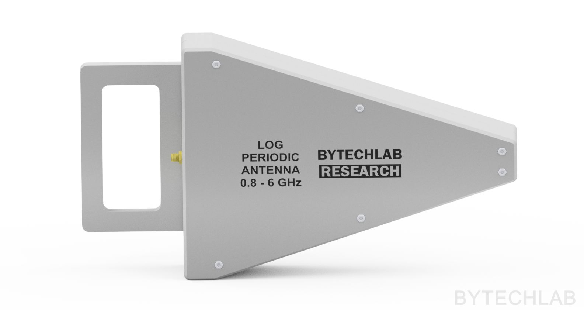

    

PCB Log Periodic Antenna (0.8-6 GHz)

### Read more at BYTECHLAB:

<table style="width: 100%; border: none;" cellspacing="0" cellpadding="0" border="0">
  <tr>
    <td></td>
    <td>https://bytechlab.com/2026/01/pcb-log-periodic-antenna-0-8-6-ghz/</td>
  </tr>
</table>